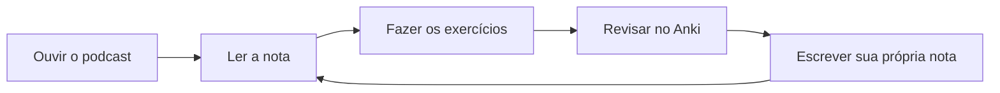

# Como usar este material

## Se você quer um curso

Siga os módulos na ordem. Cada módulo tem três páginas:

1. **A leitura** — o texto do tema, com as notas costuradas numa explicação.
2. **Os exercícios** — com gabarito escondido, para você tentar antes de ver.
3. **Os flashcards** — para fixar depois de entender.

E um episódio de podcast, que dá para ouvir no caminho do trabalho.

## Se você quer consultar

Vá direto às [notas](notas/index.md) ou use a busca (++s++ abre a caixa).
Cada nota é curta, trata de uma coisa só, e no fim mostra **quais outras
notas apontam para ela** — é assim que você descobre o que ainda não sabia
que precisava saber.

## O ciclo que funciona



O último passo é o que quase ninguém faz e é o que mais adianta: depois de
entender, **escreva com as suas palavras**. Se você não consegue explicar,
você ainda não entendeu.

## O baralho do Anki

O site serve para folhear; o Anki serve para memorizar, porque só ele
agenda as revisões. Baixe o baralho com:

```bash
poetry run python scripts/export_anki.py
```

O arquivo sai em `livro/saida/ingles-em-notas.apkg`. Abra com o Anki e
pronto — os cartões vêm separados por módulo.
