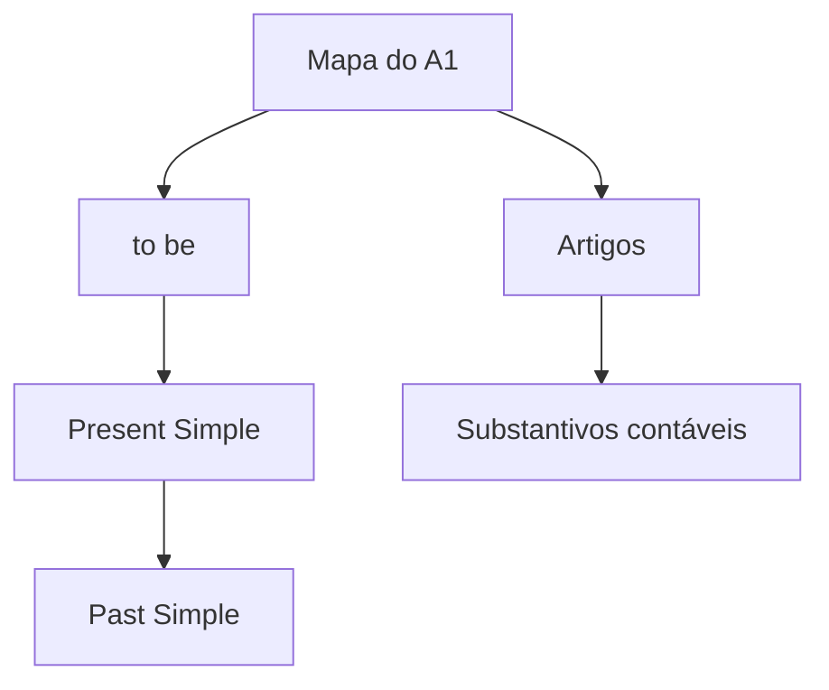

# Mapa do A1

Um *mapa de conteúdo* (no jargão Zettelkasten, um **Folgezettel**) é uma nota
cuja única função é servir de porta de entrada para um assunto. Ele não
explica nada: ele organiza.

## Estrutura da frase

- [[202609161535]] — o verbo que sustenta a frase mais simples
- [[202609161610]] — o artigo que vem junto com a profissão

## Como este mapa cresce

Cada nota nova do A1 entra aqui embaixo do subtítulo que fizer sentido. Quando
um subtítulo passar de umas oito notas, ele vira mapa próprio — e este aqui
passa a apontar para lá. A rede se reorganiza sozinha, por pressão de tamanho.

