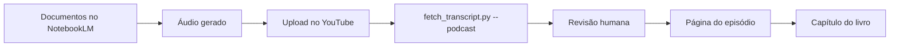

# Podcast — Inglês Entrelinhas

Episódios curtos, um por tema, gerados no **NotebookLM** a partir dos mesmos
documentos que dão origem às notas — e publicados no YouTube.

!!! info "Por que YouTube e não um feed RSS"
    O YouTube já resolve hospedagem, player, legenda automática e busca, sem
    custo. A transcrição que o próprio YouTube gera pode ser recuperada com
    `scripts/fetch_transcript.py --podcast`, revisada e publicada aqui —
    e é essa transcrição revisada que entra no livro.

## Episódios

| # | Episódio | Módulo | Duração |
| --- | --- | --- | --- |
| 01 | [Why English feels hard](ep01-why-english-feels-hard.md) | [01 · Fundações](../modulos/01-fundacoes/index.md) | 8 min |

## O fluxo de produção

